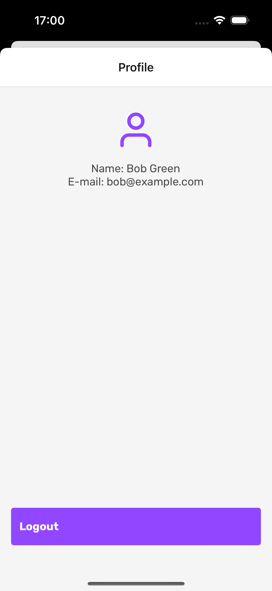

## Desafio Técnico WaProject.

## Sobre o desafio

Neste projeto, temos a missão de desenvolver um aplicativo móvel para uma ONG de adoção de animais. O objetivo principal é criar uma aplicação que permita controlar quem pode acessá-la, além de fornecer informações sobre os pets disponíveis para adoção.

Para sua criação, foram utilizadas as seguintes tecnologias:

- React native;
- Typescript;
- Styled components;
- Axios;
- Context;
- Hooks;

Princípios de Arquitetura limpa (Clean Architecture) foram utilizados no desenvolvimento deste projeto.

## Como Executar

Caso você deseje, há um arquivo APK disponível na raiz do projeto.

```terminal
Clone o repositorio:
$ git clone git@github.com:iamlipe/DesafioWaPet.git

$ cd DesafioWaPet

Configure o arquivo .env:
Existe um arquivo .env.example na raiz do projeto, basta renomeá-lo para apenas .env.

Instale todas as dependências:
$ yarn install

Iniciar o app no IOS:
$ cd ios pod install && cd ..
$ yarn run ios

Iniciar o app no Android:
$ yarn run android

executar testes unitários
$ yarn run test
```

## Preview

<div>
 
 
 
 
 
</div>
